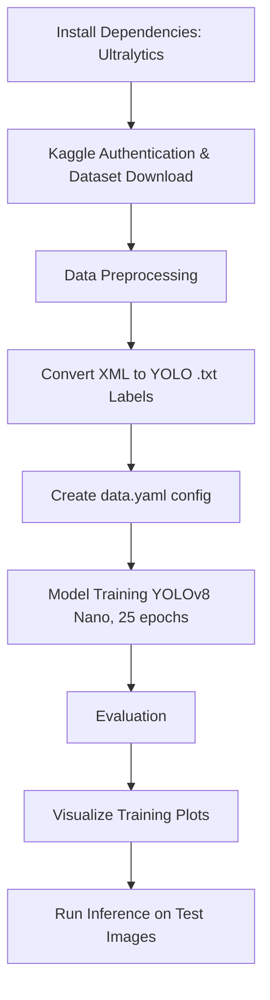

# Pothole Detection Project Evaluation & Documentation

## 1. Tech Stack & Libraries
This project leverages state-of-the-art computer vision tools and cloud infrastructure to build an automated pothole detection system.

*   **Core Framework**: [Ultralytics YOLOv8](https://github.com/ultralytics/ultralytics) - Used for object detection, providing a high-performance, real-time architecture.
*   **Model**: YOLOv8 Nano (`yolov8n.pt`)
*   **Language**: Python 3.12
*   **Environment**: Google Colab (with GPU acceleration via Tesla T4).
*   **Data Source**: [Kaggle](https://www.kaggle.com/) - Specifically the Annotated Potholes Dataset.
*   **Libraries**:
    *   `ultralytics`: Model training and inference.
    *   `opencv-python` & `PIL`: Image processing and visualization.
    *   `xml.etree.ElementTree`: Parsing XML annotations (Pascal VOC format) to YOLO format.
    *   `matplotlib`: Plotting training metrics and results.
    *   `shutil` & `pathlib`: File system management and directory restructuring.
    *   `streamlit`: For running the web application (`app.py`).

## 2. Project Workflow Diagram
Below is the step-by-step pipeline executed in the training notebook:

## 3. Training Implementation Details
*   **Annotation Conversion**: The original dataset provides XML files. We convert these to YOLO format (`<class> <x_center> <y_center> <width> <height>`) normalized between 0 and 1.
*   **Training Configuration**: We use the YOLOv8 Nano (`yolov8n.pt`) model for efficiency.
*   **Hyperparameters**: 
    *   **Epochs**: 25
    *   **Image Size**: 640px

## 4. Metrics & Performance
After training the YOLOv8 Nano model for 25 epochs, the following evaluation metrics were achieved on the validation dataset:

*   **mAP50**: `0.8223` (Mean Average Precision at 50% IoU)
*   **mAP50-95**: `0.5409` (Mean Average Precision from 50% to 95% IoU)

These metrics indicate that the model performs reasonably well at detecting potholes, especially considering the lightweight nature of the Nano model and the short training duration.
